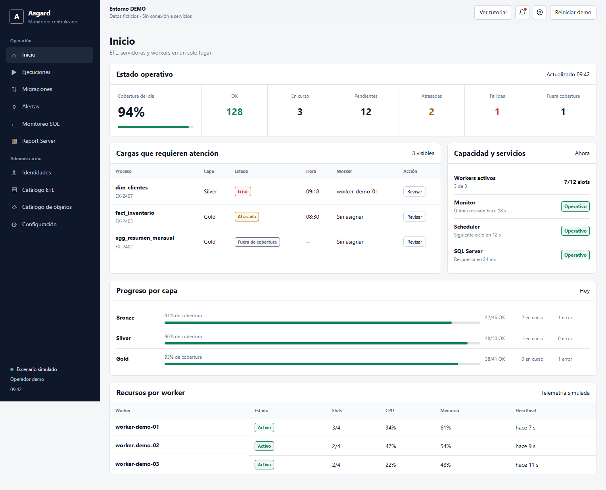
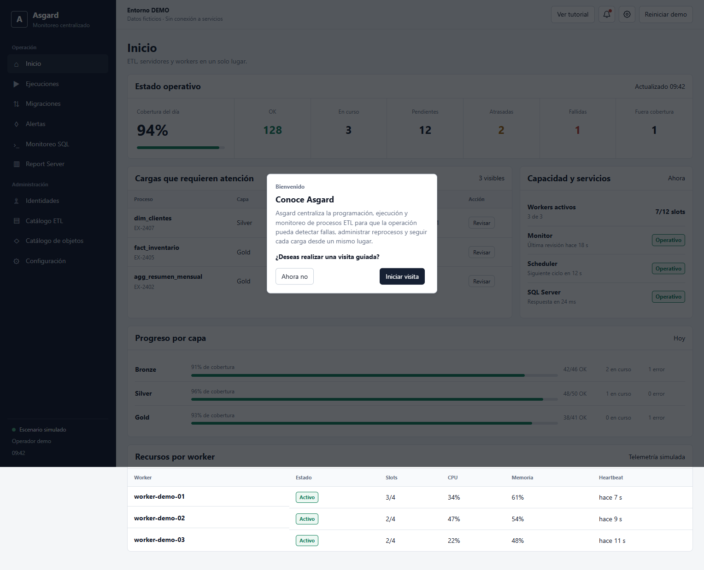

# Asgard Dashboard Demo

Demostración estática e interactiva de una consola de operaciones para procesos ETL. El proyecto está pensado como pieza de portafolio: presenta el lenguaje visual y los principales flujos de Asgard sin conectarse a bases de datos, workers, schedulers, servicios de identidad ni Report Server.

> Todos los procesos, servidores, identidades, consultas y eventos de esta demostración son ficticios. Las acciones solo modifican el estado de la pestaña actual.





## Qué se puede probar

- Revisar el estado diario de cargas, capacidad y servicios.
- Filtrar ejecuciones y reencolar un intento fallido.
- Consultar notificaciones operativas.
- Crear una migración de demostración.
- Inspeccionar actividad SQL sin ejecutar acciones destructivas.
- Revisar y actualizar de forma simulada un reporte.
- Explorar alertas, identidades, catálogo y configuración en modo lectura.
- Conocer primero qué hace Asgard y decidir si se desea iniciar una visita guiada de ocho pasos.
- Observar las transiciones simuladas de las acciones antes de que el tutorial continúe.

## Ejecutar localmente

No necesita backend. Los módulos del navegador sí deben servirse por HTTP:

```bash
npm install
npm run serve
```

Después abre `http://127.0.0.1:4173`.

## Pruebas

```bash
npm test
```

Las pruebas de navegador comprueban navegación, tutorial, persistencia de sesión, acciones simuladas, temas y ausencia de llamadas a `/api`.

## Publicar en GitHub Pages

1. Crea un repositorio con este contenido y usa `main` como rama principal.
2. En **Settings → Pages**, selecciona **GitHub Actions** como fuente.
3. Haz `push`; el flujo incluido publica el directorio completo.

Las rutas son relativas y la navegación usa fragmentos (`#ejecuciones`), por lo que funciona desde una subruta de GitHub Pages.

## Estado local

Los cambios operativos se guardan en `sessionStorage`. **Reiniciar demo** restaura el escenario sin cambiar la preferencia del tutorial. La marca de tutorial completado es el único dato guardado en `localStorage`.
